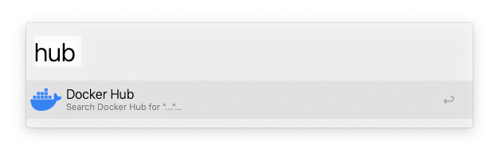
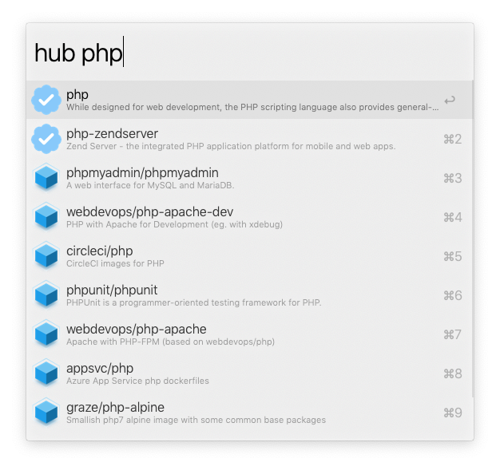
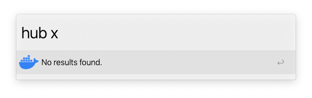
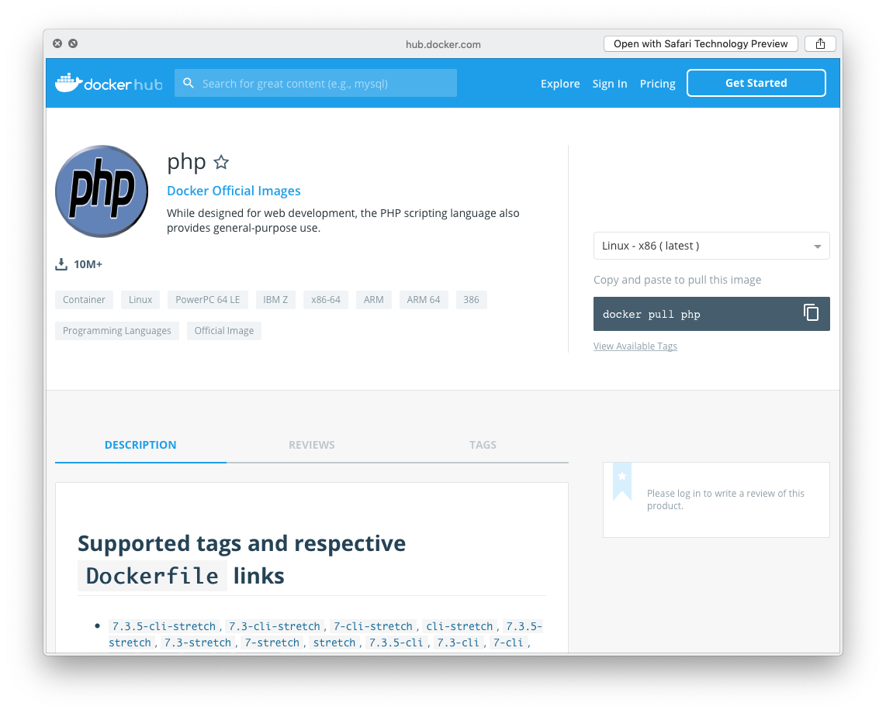

# docker-hub.alfredworkflow

An Alfred PowerPack Workflow for searching Docker Hub for public Docker images.

## Installation

Download the `.dmg` file from the [latest release](https://github.com/cdzombak/docker-hub.alfredworkflow/releases/latest), open the downloaded `.dmg` file, and double-click the `.alfredworkflow` file to install it.

## Usage

`dockerhub {query}` — Search for an image.

### Actions

- `↩` — Open the module in the Docker Hub UI
- `⇧/⌘Y` — QuickLook details

## Screenshots

  
  
  

## About

Maintained by [Chris Dzombak](https://www.dzombak.com) ([@cdzombak on GitHub](https://github.com/cdzombak)).

Originally based on [skyzyx/docker-hub.alfredworkflow](https://github.com/skyzyx/docker-hub.alfredworkflow).

Principal changes in @cdzombak's fork:
- Use Go Modules for dependency management
- Use GitHub Actions for the build & release process
- Codesign the embedded `dockerhub` binary for distribution outside the Mac App Store
- Notarize the workflow for distribution

## License

BSD 2-clause; see LICENSE in this repository.
